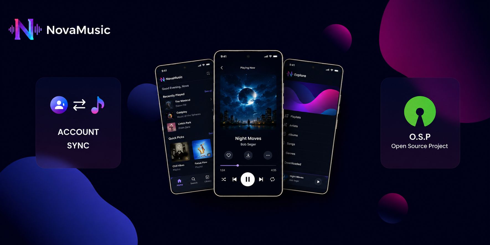

# NovaMusic

<div align="center">

  

  ### Advanced YouTube Music client with Material Design 3 for Android

  [](https://github.com/CodeWithTayyab96/NovaMusic-/releases)
  [](https://github.com/CodeWithTayyab96/NovaMusic-/blob/main/LICENSE)
  [](https://www.android.com)
  [](.github/workflows/build.yml)

</div>

---

## Table of Contents

- [Overview](#overview)
- [Key Features](#key-features)
- [Technology Stack](#technology-stack)
- [Project Structure](#project-structure)
- [Downloads Architecture](#downloads-architecture)
- [Installation](#installation)
- [Building from Source](#building-from-source)
- [Releases & the In-App Updater](#releases--the-in-app-updater)
- [Continuous Integration](#continuous-integration)
- [Support](#support)
- [Contributing](#contributing)
- [Upstream Attribution](#upstream-attribution)
- [License](#license)

---

## Overview

**NovaMusic** is an open-source YouTube Music client for Android, forked from
[OpenTune](https://github.com/Arturo254/OpenTune) (itself part of the
InnerTune / ArchiveTune lineage). It delivers a modern interface built on
**Jetpack Compose** and **Material Design 3**, with advanced features to
explore, play, and manage music without the limitations of the official
application.

The app is a multi-module Kotlin project using **Media3 / ExoPlayer** for
playback, **Hilt** for dependency injection, **Room** for local storage, and
**Jetpack Compose** for the UI.

### What makes NovaMusic different from stock OpenTune

- **Real offline downloads (the headline feature).** Songs are saved as
  *actual playable audio files* in `Music/NovaMusic/` via MediaStore — not an
  opaque app cache. Downloads run through WorkManager so they survive closing
  or killing the app, show live per-song progress (including in the
  notification shade), and produce files that any music player can open.
  See [Downloads Architecture](#downloads-architecture).
- **Independent branding and identity.** New name, package
  (`com.novamusic.app`), logo, launcher icons, and a fresh version history
  starting at 1.0.0.
- **Self-hosted update channel.** The in-app updater checks **this**
  repository's GitHub Releases (not upstream's), so updates always come from
  NovaMusic itself.
- **Release signing & CI/CD.** A signed release pipeline publishes APKs as
  GitHub Release assets, ready for sideloading or a future store.

> **Note**: NovaMusic is an independent project and is not affiliated with,
> sponsored by, or endorsed by YouTube or Google.

---

## Key Features

### Core Functionality

| Feature | Description |
|---|---|
| 🎵 **Ad-free playback** | Enjoy music without advertising interruptions |
| 🔄 **Background playback** | Continue listening while using other applications |
| 🔍 **Advanced search** | Quickly find songs, videos, albums, playlists, and artists |
| 📥 **Real file downloads** | Downloads are written to disk via MediaStore (`Music/NovaMusic/`) as playable audio files, driven by WorkManager so they survive app close/kill |
| 📥 **Download queue** | Live per-song progress (queued / downloading / completed / failed) with cancel and remove actions |
| 📚 **Library management** | Albums, artists, playlists, history, favorites, and statistics — all stored locally in Room |
| 📱 **Offline mode** | Downloaded songs are flagged `isLocal` and the player prefers the local file automatically |
| 💾 **Backup & restore** | Export and import your library and settings |
| 📊 **Stats & Year in Music** | Playback statistics and yearly listening summaries |
| 🔀 **Explore & charts** | Moods & genres, new releases, and charts browsing |

### Audio Enhancements

| Feature | Description |
|---|---|
| 🎤 **Synchronized lyrics** | Synced lyrics from multiple providers (LRC Lib, Kugou, SimpMusic, BetterLyrics, Kizzy, YouTube subtitles, and more) |
| ⚡ **Smart silence skip** | Automatically skips silent segments |
| 🔊 **Volume normalization** | Balances loudness across tracks |
| 🎛️ **Tempo & pitch control** | Adjust playback speed and pitch |
| 🔄 **Crossfade** | Seamless transitions between tracks |
| 🎚️ **Equalizer** | Full equalizer and audio effects |
| ⏱️ **Sleep timer** | Stop playback automatically |

### Personalization & Integration

| Feature | Description |
|---|---|
| 🎨 **Dynamic theming** | The interface adapts to album artwork colors |
| 🌐 **Multi-language support** | 20+ languages maintained via community translations |
| 🚗 **Android Auto compatible** | Integration with vehicle infotainment systems |
| 🧩 **Widgets** | Home-screen player widgets (Glance) |
| 🎯 **Material Design 3** | Design aligned with Google's latest guidelines |
| 🖼️ **Artwork export** | Save high-resolution album images |
| 🎬 **Animated artwork** | Animated covers powered by the Apple Music canvas API |
| 🎧 **Spotify integration** | Import and browse Spotify playlists / library |
| 🎤 **Song recognition** | ShazamKit-based recognition module |
| 🤖 **PoToken support** | Handle YouTube streaming authorization tokens |

---

## Technology Stack

| Layer | Technology |
|---|---|
| Language | Kotlin 2.3.20 |
| UI | Jetpack Compose (1.11.0-rc01) + Material 3 (1.5.0-alpha18) |
| Playback | Media3 / ExoPlayer 1.10.0 (HLS, OkHttp data source) |
| Local storage | Room 2.8.4 + DataStore (Preferences) |
| DI | Hilt 2.59.2 (KSP) |
| Background work | WorkManager 2.11.2 |
| Networking | Ktor 3.4.2, OkHttp 5, NewPipe Extractor |
| Images | Coil 3.4.0 |
| Build | Android Gradle Plugin 9.1.0, Gradle wrapper 9.4.1, JDK 21 |
| Other | Glance widgets, Reorderable, Haze, Squiggly Slider, Timber, Jsoup |

---

## Project Structure

Multi-module Gradle project — the app itself plus library modules:

| Module | Purpose |
|---|---|
| `app` | Main application: UI, playback, database, view models |
| `innertube` | YouTube Music InnerTube API client |
| `spotify` | Spotify API client (playlists, library, playback resolution) |
| `kugou` | Kugou lyrics provider |
| `lrclib` | LRC Lib synced-lyrics provider |
| `lastfm` | Last.fm scrobbling / metadata |
| `betterlyrics` | Additional lyrics provider |
| `kizzy` | Lyrics provider (Kizzy API) |
| `simpmusic` | SimpMusic lyrics provider |
| `canvas` | Animated artwork (Apple Music canvas) support |
| `shazamkit` | Song recognition |
| `jossredconnect` | Streaming / download helper library |

---

## Downloads Architecture

Downloads use a dedicated, app-owned pipeline instead of Media3's
download-to-disk:

- `playback/LocalFileDownloader.kt` — `@Singleton` downloader; exposes
  `progress: StateFlow<Map<String, LocalDownloadState>>`;
  `download(songId, title, artist)` streams the raw audio through the
  resolver-equipped OkHttp client and saves it to **MediaStore
  (`Music/NovaMusic/`)**; `deleteLocalFile(songId)` removes the file and
  resets the entity. Downloads verify HTTP response content-type, byte
  completeness against `Content-Length`, and the audio container's magic
  header before being marked complete — a corrupted or truncated file is
  rejected and rolled back rather than saved.
- `playback/LocalFileDownloadWorker.kt` — WorkManager `CoroutineWorker` that
  fetches the downloader via a Hilt `@EntryPoint`, so downloads continue in
  the background and survive app close/kill. A foreground notification shows
  per-song progress (with a cancel action) and groups multiple active
  downloads into a single summary notification.
- Completed downloads set `isLocal = true` + `localPath` on the `SongEntity`;
  `Song.toMediaItem()` prefers the local file at playback time.
- The Media3 `DownloadUtil` / `ExoDownloadService` system remains for the
  streaming cache (player cache) — only the download-to-disk path was
  replaced.

---

## Installation

### System Requirements

| Component | Requirement |
|:----------|:------------|
| Operating System | Android 8.0 (Oreo, API 26) or higher |
| Network | Internet connection for streaming |
| Storage | Varies with library size; downloaded files live in `Music/NovaMusic/` |

### Install from GitHub Releases

GitHub Releases is the current (and only) distribution channel:

1. Go to the [Releases](https://github.com/CodeWithTayyab96/NovaMusic-/releases)
   page
2. Download the APK for the latest stable version
   (`app-universal-release.apk`)
3. Enable "Install from unknown sources" in your device's security settings
4. Open the downloaded APK to install

> **Security notice**: Only install the app from the official GitHub Releases
> page. Avoid APKs from unverified sources.

---

## Building from Source

### Prerequisites

| Tool | Required |
|---|---|
| JDK | **21** (the project sets `kotlin.jvmToolchain(21)` and `compileOptions` `JavaVersion.VERSION_21`) |
| Android SDK | Platform **API 36** (compileSdk 36, targetSdk 36, minSdk 26) |
| Android Studio | Current stable release (2024.2+ recommended) |
| Gradle | None to install — the **wrapper (9.4.1)** handles the version |

No Gradle installation or version pinning is needed: always use `./gradlew`.

> **Note**: The foojay toolchain auto-provisioning plugin is disabled in
> `settings.gradle.kts` (for F-Droid compatibility), so your JDK itself must
> be version 21 — a JDK 17 installation will fail with "No matching
> toolchains found".

### Build

This project defines **ABI product flavors** — `universal`, `arm64`,
`armeabi`, `x86`, `x86_64` — so there is no plain `assembleDebug` task. Use a
flavor-specific task:

```bash
# Debug APK containing all ABIs (the common choice for testing)
./gradlew assembleUniversalDebug

# Release (requires signing credentials via STORE_PASSWORD / KEY_ALIAS / KEY_PASSWORD env vars
# and a keystore at app/keystore/release.keystore — that file is not in the repo,
# so create your own for local release builds)
./gradlew assembleUniversalRelease

# Build every flavor × build type, plus unit tests
./gradlew build

# Run unit tests only
./gradlew test

# Clean
./gradlew clean
```

On low-memory machines (≈8 GB or less), a full `./gradlew build` can exhaust
the heap while compiling all ten variant combos — use
`./gradlew build --no-parallel --max-workers=2` in that case (this is what
CI does).

APKs are produced under `app/build/outputs/apk/<flavor>/<buildType>/`, e.g.
`app/build/outputs/apk/universal/debug/app-universal-debug.apk`.

### Build from Android Studio

1. Open Android Studio → "Open an existing Android Studio project"
2. Select the project directory and wait for Gradle sync
3. Run ▶ with the `universalDebug` variant selected, or use Build → Build APK(s)

---

## Releases & the In-App Updater

- NovaMusic has its own version history starting at **1.0.0**
  (`versionCode 1`), independent of the OpenTune 3.0.6 numbering it forked
  from.
- The in-app updater (`utils/Updater.kt`) checks the latest **stable** release
  of `CodeWithTayyab96/NovaMusic-` and compares it against the app's
  `versionName` using semver. **For an update to be recognized, the release
  tag must match the app's `versionName`** (e.g. release tag `v1.0.1` + app
  `versionName "1.0.1"`), and `versionCode` should be bumped so Android
  allows installing over the previous APK.
- Release assets must be named exactly **`app-universal-release.apk`** — the
  updater constructs its download URL from that name.

---

## Continuous Integration

GitHub Actions workflows live in `.github/workflows/`:

- **`build.yml`** — runs on push to `main`/`master` and manual
  `workflow_dispatch`:
  - **Build Debug APK** job: JDK 21 (Temurin), `./gradlew assembleUniversalDebug`,
    uploads the APK from `app/build/outputs/apk/universal/debug/` as an artifact.
  - **Full build + unit tests** job: `./gradlew build --no-parallel --max-workers=2`
    (all variants + tests). Intentionally independent of the APK job, so test
    failures never block the APK artifact.
- **`release-build.yml`** — manual only. Prompts for a `version` input (e.g.
  `v1.0.1`), decodes the signing keystore from the `KEYSTORE_BASE64` secret,
  builds `assembleUniversalRelease`, publishes a GitHub Release tagged with
  the version, uploads the APK as an asset, and deletes the decoded keystore
  from the runner afterward.
- **`generate-keystore.yml`** — manual one-time helper that generates a
  release keystore with `keytool` and uploads it as a temporary artifact.
- **`android.yml`** — manual `assembleArm64Debug` build.
- **`pr-debug-build.yml`** — debug build on every pull request.

---

## Support

- **Bug reports & feature requests**: open an issue on the
  [issue tracker](https://github.com/CodeWithTayyab96/NovaMusic-/issues).
- **Releases**: see the [Releases](https://github.com/CodeWithTayyab96/NovaMusic-/releases)
  page.

---

## Contributing

Contributions are welcome! Please read
[CONTRIBUTING.md](CONTRIBUTING.md) and our
[Code of Conduct](CODE_OF_CONDUCT.md) first, then open an issue or a pull
request on the [repository](https://github.com/CodeWithTayyab96/NovaMusic-).

---

## Upstream Attribution

NovaMusic is a fork of **[OpenTune](https://github.com/Arturo254/OpenTune)**
(by Arturo Cervantes), which in turn descends from the
[InnerTune](https://github.com/z-huang/InnerTune) / ArchiveTune project
lineage. NovaMusic builds directly on OpenTune 3.0.6 and inherits its
architecture, features, and community translations. All original copyright
and license notices are preserved in the source files.

Special thanks to the upstream projects and people:

- **OpenTune** (Arturo254/OpenTune) — the direct upstream base of this app
- **InnerTune** / **ArchiveTune** — the original project lineage
- **Vivi Music** — source of the Canvas API and inspiration
- **@Fabito02** — constant support, feedback, and ideas
- **mostafaalagamy** — MetroList implementation
- **Community translators** — making the app accessible worldwide
- **Beta testers** — improving stability and usability

---

## License

NovaMusic is licensed under the **GNU General Public License v3.0** (or later),
inherited from its upstream projects. This is copyleft: you are free to use,
study, modify, and redistribute the app, provided any derivative works are
also released under GPLv3 and preserve the original copyright and license
notices.

**Copyright © 2025 Arturo Cervantes (OpenTune)** — the upstream base.

Full license text: [LICENSE](LICENSE) ·
[GPL v3](https://www.gnu.org/licenses/gpl-3.0)

<div align="center">

[](https://www.gnu.org/licenses/gpl-3.0)

</div>
